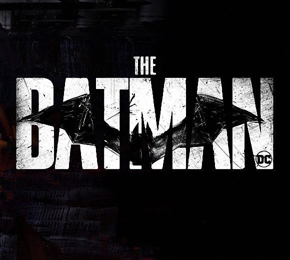

 

  
  

---

### 🦇 About Me

- 🔭 Currently building a **Mental Health Score Predictor**
- 🌱 Sharpening my skills in **full-stack development** and **machine learning**
- 📫 Reach me at **alokkumargujar449@gmail.com**
- ⚡ *"It's not who I am underneath, but what I code that defines me."*

---

### 🛠️ Languages & Tools

  
  
  
  
  
  
  
  
  
  

---

### 📊 GitHub Stats

 

 

---

### 🏆 Trophies

  

---

### 🎯 Featured Projects

> ✏️ Replace `REPO_NAME_1` / `REPO_NAME_2` above with your actual repository names (e.g. your Mental Health Score Predictor repo) to pin them here.

---

  

<i>"It's not about how hard you commit, it's about how many commits you can withstand." 🦇</i>

